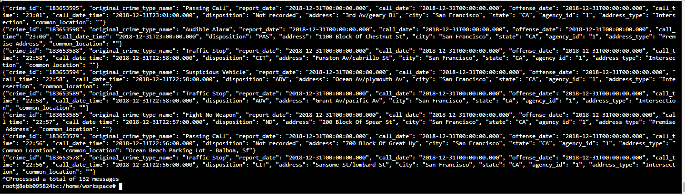
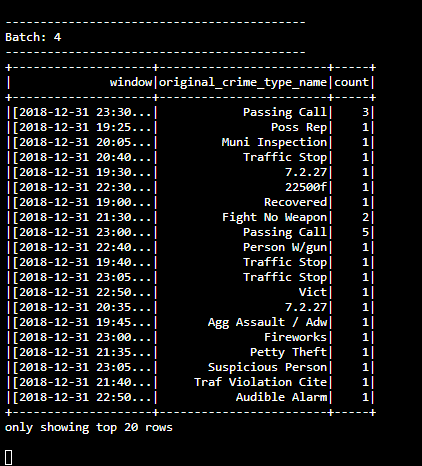
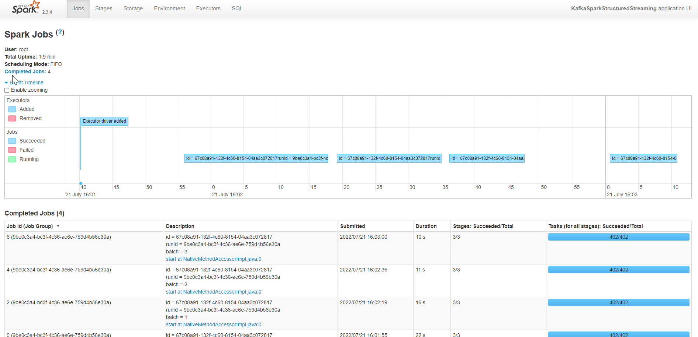

# SF Crime Statistics with Spark Streaming

## Screenshots

### Kafka Consumer Console Output

### Progress Report

### Spark Streaming UI

## Questions
1. How did changing values on the SparkSession property parameters affect the throughput and latency of the data?

The total time the execute jobs depended on whether the throughput was increased or decreased.

2. What were the 2-3 most efficient SparkSession property key/value pairs? Through testing multiple variations on values, how can you tell these were the most optimal?

The "spark.executor.memory" and "spark.executor.cores" properties set at 2G.
